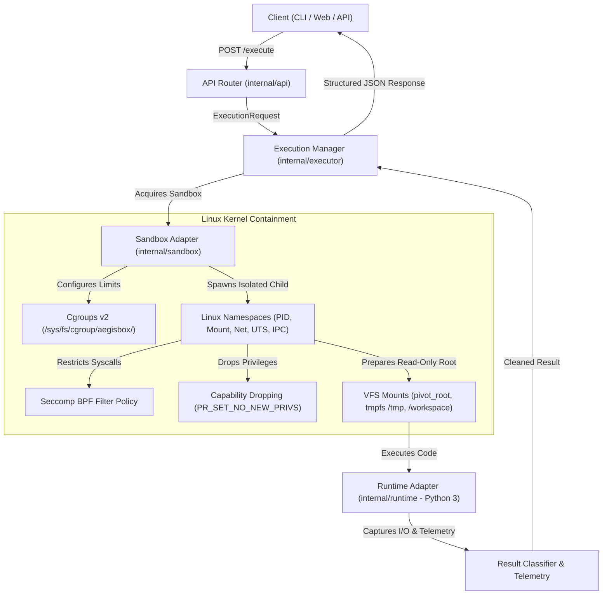

# AegisBox — Secure Ephemeral Code Execution Engine

[](https://github.com/fendyramadhani9-cloud/aegisbox/actions/workflows/ci.yml)
[](https://golang.org)
[](https://kernel.org)
[](LICENSE)

AegisBox is an isolated, ephemeral Linux code execution engine built from scratch without Docker. It is designed to demonstrate deep Linux systems programming, container internals (Namespaces, Cgroups v2, Seccomp BPF, VFS Isolation), and platform engineering practices.

---

## 1. High-Level Architecture



---

## 2. Core Linux Isolation Mechanisms

AegisBox avoids third-party container engines (Docker, containerd) and implements Linux kernel containment primitives directly:

| Layer | Kernel Mechanism | AegisBox Implementation | Defense Purpose |
| :--- | :--- | :--- | :--- |
| **Process Tree** | `CLONE_NEWPID` | `namespace_linux.go` | Sandboxed process perceives itself as PID 1; cannot inspect or signal host processes. |
| **Filesystem Mounts** | `CLONE_NEWNS` + `pivot_root` | `mount_linux.go` | Read-only base rootfs template, ephemeral `tmpfs` `/workspace` and `/tmp`, isolated `/proc`. Host `/` is completely hidden. |
| **Networking** | `CLONE_NEWNET` | `namespace_linux.go` | New empty network namespace with zero external routes; disables internet access and LAN egress. |
| **Resource Limits** | Cgroups v2 | `cgroup_linux.go` | Enforces `memory.max`, `memory.swap.max`, `cpu.max`, and `pids.max` (anti-fork-bomb). |
| **Syscall Defense** | Seccomp BPF | `seccomp_linux.go` | Blocks dangerous kernel calls (`mount`, `reboot`, `ptrace`, `kexec_load`, `init_module`, raw sockets). |
| **Privilege Reduction** | `PR_SET_NO_NEW_PRIVS` | `capabilities_linux.go` | Clears ambient capabilities and prevents gaining root via `setuid` binaries. |
| **Deterministic Cleanup** | `CleanupTracker` | `cleanup.go` | Guaranteed teardown of mounts, cgroup destruction (`cgroup.kill`), and ephemeral workspace removal. |

---

## 3. Development & Runtime Workflow

AegisBox uses a **dual-environment development lifecycle**:

```text
[ Windows 11 Workstation ]
  ├── VS Code / PowerShell
  ├── Cross-platform Go compilation
  └── Generic unit tests & API mocks
            │
            ▼ (git push)
[ GitHub Actions CI / CD ]
  ├── gofmt formatting verification
  ├── go vet static analysis
  ├── go test -race unit tests
  └── automated binary compilation
            │
            ▼ (deploy)
[ Ubuntu Linux Host ]
  ├── Linux Kernel 6.x (Cgroups v2, Namespaces, Seccomp)
  ├── Minimal RootFS Template (/opt/aegisbox/rootfs/python)
  └── AegisBox Systemd Daemon (aegisbox.service)
```

---

## 4. REST API Specification

### `POST /execute`

Executes source code inside an isolated ephemeral sandbox.

#### Request Body
```json
{
  "language": "python",
  "code": "import sys\nprint('Hello from AegisBox!')",
  "timeout_ms": 1000,
  "max_mem_mb": 64,
  "max_processes": 10
}
```

#### Response Body
```json
{
  "execution_id": "exec-4a9b2c8f1e",
  "status": "COMPLETED",
  "stdout": "Hello from AegisBox!\n",
  "stderr": "",
  "exit_code": 0,
  "execution_time_ms": 19,
  "memory_usage_bytes": 14680064,
  "cpu_time_ms": 12
}
```

### Supported Execution Statuses

- `COMPLETED`: Script completed normally (exit code 0).
- `RUNTIME_ERROR`: Script encountered an uncaught exception or non-zero exit code.
- `TIME_LIMIT_EXCEEDED`: Execution exceeded configured wall-clock timeout.
- `OOM_KILLED`: Process exceeded allocated memory limit (`memory.max`).
- `PROCESS_LIMIT_EXCEEDED`: Process/thread creation exceeded `pids.max` (fork-bomb prevented).
- `START_ERROR`: Initialization or runtime preparation failure.
- `SANDBOX_ERROR`: Internal containment error.
- `UNSUPPORTED_LANGUAGE`: Requested runtime is not registered.

### `GET /health`

Returns diagnostic and operational health metadata:

```json
{
  "status": "ok",
  "version": "0.1.0",
  "os": "linux",
  "arch": "amd64",
  "supported_languages": ["python"]
}
```

---

## 5. CLI Usage

The AegisBox CLI allows running executions directly or managing the daemon:

```bash
# Start the REST API server
aegisbox server -port 8080 -host 0.0.0.0

# Execute Python code directly via CLI
aegisbox execute \
  -language python \
  -code 'print("Hello from CLI")' \
  -timeout 1000 \
  -memory 64

# Health check
aegisbox health

# Version information
aegisbox version
```

---

## 6. Linux Installation & Systemd Deployment

### Step 1: Clone and Build
```bash
git clone https://github.com/fendyramadhani9-cloud/aegisbox.git
cd aegisbox
make build
```

### Step 2: System Installation
```bash
sudo ./scripts/install.sh
```

This script:
1. Installs the binary to `/usr/local/bin/aegisbox`.
2. Creates directory hierarchy at `/opt/aegisbox`.
3. Prepares the minimal Python rootfs at `/opt/aegisbox/rootfs/python`.
4. Installs the systemd unit file at `/etc/systemd/system/aegisbox.service`.

### Step 3: Manage Systemd Service
```bash
sudo systemctl enable --now aegisbox.service
sudo systemctl status aegisbox.service
```

---

## 7. Testing & Verification

Run the full automated test suite:

```bash
# Run all unit and integration tests with race detector
go test -v -race ./...

# Run static analysis
go vet ./...

# Verify code formatting
gofmt -l .
```

---

## 8. Security Model & Honest Limitations

> [!IMPORTANT]
> AegisBox is an educational and platform engineering research sandbox. While it implements multi-layered defense-in-depth, no sandbox is invincible.

### Security Defenses
- **Process Isolation**: Dedicated PID namespace; process cannot see host PID space.
- **Filesystem Jailing**: Base rootfs is mounted strictly read-only; `/workspace` and `/tmp` are isolated `tmpfs` mounts.
- **Network Egress**: Network namespaces without virtual ethernet interfaces guarantee zero network I/O.
- **Resource Protection**: Cgroups v2 protects against memory exhaustion, CPU starvation, and fork-bomb attacks.
- **Syscall Restrictions**: Seccomp filter blocks kernel manipulation, root pivot escapes, and ptrace interception.

### Documented Limitations
- **Kernel Vulnerabilities**: Kernel-level privilege escalations (e.g. dirty pipe, use-after-free in kernel modules) could theoretically compromise the host.
- **Side Channels**: Timing and cache side-channel attacks (e.g., Spectre/Meltdown) are not mitigated by software namespaces.
- **Rootless vs Root Execution**: Full mount and pivot_root operations require initial root capability or configured user namespaces.

---

## 9. Medium Learning Series Outline

This codebase serves as the reference implementation for our comprehensive Medium engineering publication series:

1. **Part 1**: *The Anatomy of a Linux Process (PID, PPID, fork, exec, and wait)*
2. **Part 2**: *Virtualizing the Process Tree with Linux PID Namespaces*
3. **Part 3**: *Filesystem Jailing: Read-Only RootFS, Mount Namespaces & pivot_root*
4. **Part 4**: *Zero-Trust Networking: Isolating Sandboxes with Network Namespaces*
5. **Part 5**: *Hard Resource Control: Mastering Cgroups v2 (Memory, CPU & Anti-Fork-Bombs)*
6. **Part 6**: *Syscall Defense: Crafting Seccomp BPF Filters from Scratch*
7. **Part 7**: *Building a Resilient Process Lifecycle & Execution Engine in Go*
8. **Part 8**: *From Code to Cloud: Automated CI/CD & Systemd Deployment on Ubuntu*
