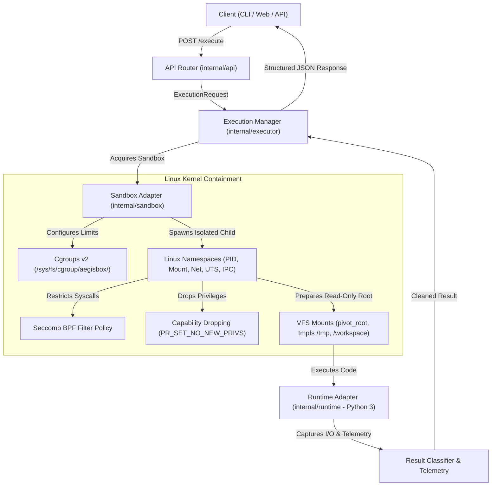

# AegisBox — Secure Ephemeral Code Execution Engine

[](https://github.com/fendyramadhani9-cloud/aegisbox/actions/workflows/ci.yml)
[](https://golang.org)
[](https://kernel.org)
[](LICENSE)

AegisBox is an isolated, ephemeral Linux code execution engine built from scratch without Docker. It is designed to demonstrate deep Linux systems programming, container internals (Namespaces, Cgroups v2, Seccomp BPF, VFS Isolation), and platform engineering practices.

---

## 1. High-Level Architecture



---

## 2. Continuous Delivery Pipeline Architecture

AegisBox explicitly adheres to **Continuous Delivery** rather than Continuous Deployment. Every release artifact is verified automatically, but physical rollout to the private runtime VM requires **manual human approval** by the environment owner.

### Delivery Flow

```text
Windows Workstation
   ↓ (git push)
GitHub Repository
   ↓
GitHub Actions CI
   ├── gofmt formatting verification
   ├── go vet static analysis
   ├── go test -race unit & integration tests
   └── binary compilation & smoke checks
          ↓
       CI PASS
          ↓
GitHub Environment: "production"
          ↓
   [ MANUAL APPROVAL GATE ] (Repository Owner)
          ↓
Release Artifact Ready (aegisbox-linux-amd64.tar.gz)
          ↓
Windows Operator (PowerShell / SSH)
          ↓
Ubuntu 24.04 VMware VM (192.168.1.9)
          ↓
Atomic Release Symlink (/opt/aegisbox/releases/current)
          ↓
systemd (aegisbox.service)
          ↓
HTTP Health Check Verification (GET /health -> 200 OK)
          ├── PASS: Active Release Retained
          └── FAIL: Automatic Instant Rollback to Previous Release
```

### Why Continuous Delivery?
- **Network Topology**: The Ubuntu VMware runtime resides on a private local area network (`192.168.1.9`) and is deliberately **not exposed to the public internet**. GitHub-hosted runners cannot and should not SSH into private LAN infrastructure.
- **Operator Governance**: High-impact infrastructure changes require intentional, verified operator execution.

---

## 3. GitHub Environment & Approval Gate Setup

To enforce the manual approval gate on GitHub:

1. Open your repository on GitHub: **Settings $\rightarrow$ Environments**.
2. Click **New environment** and name it `production`.
3. Under **Deployment protection rules**, check **Required reviewers**.
4. Add yourself (`fendyramadhani9-cloud`) as the designated reviewer.
5. Save the protection rules.

When code is pushed to `main`, the `build-release-artifact` job will package the release and pause at `production-approval-gate` until you review and click **Approve and deploy** in the GitHub Actions UI.

---

## 4. Release Artifact Specification

The CD workflow produces a standalone, reproducible release package named `aegisbox-linux-amd64.tar.gz` containing:

```text
aegisbox-linux-amd64.tar.gz
├── bin/
│   └── aegisbox                # Statically linked Linux amd64 binary (with injected GitCommit & BuildTime)
├── configs/
│   └── config.yaml             # Runtime and limit defaults
├── deploy/
│   └── aegisbox.service        # Hardened systemd service definition
├── scripts/
│   ├── install.sh              # Idempotent host installation script
│   ├── deploy.sh               # Atomic release deployment & rollback script
│   └── setup-rootfs.sh         # Python rootfs generator
└── RELEASE_METADATA            # Metadata file (VERSION, COMMIT_SHA, BUILD_TIME)
```

---

## 5. Deployment to Ubuntu VMware VM (`192.168.1.9`)

### Option A: One-Command Deployment from Windows (Recommended)

From your Windows workstation in VS Code / PowerShell:

```powershell
# Deploy the latest release artifact over SSH:
.\scripts\deploy-remote.ps1 -TargetHost "192.168.1.9" -TargetUser "ubuntu"
```

This PowerShell script:
1. Uploads `dist/aegisbox-linux-amd64.tar.gz` to `ubuntu@192.168.1.9:/tmp/`.
2. Triggers `sudo /opt/aegisbox/scripts/deploy.sh` remotely over SSH.
3. Automatically queries `http://192.168.1.9:8080/health` from Windows to verify deployment health.

### Option B: Manual SSH Deployment

```bash
# 1. Transfer release archive to VM
scp dist/aegisbox-linux-amd64.tar.gz ubuntu@192.168.1.9:/tmp/

# 2. Connect via SSH and trigger deployment
ssh ubuntu@192.168.1.9 "sudo /opt/aegisbox/scripts/deploy.sh /tmp/aegisbox-linux-amd64.tar.gz 8080"
```

---

## 6. Linux Runtime Directory Layout & Zero-Downtime Releases

On the Ubuntu host, releases are organized to guarantee zero-downtime swaps and instant rollback:

```text
/opt/aegisbox/
├── bin/
│   └── aegisbox -> /opt/aegisbox/releases/current/bin/aegisbox
├── config/
│   └── config.yaml -> /opt/aegisbox/releases/current/configs/config.yaml
├── releases/
│   ├── 6adc3d0/                # Release directory for commit 6adc3d0
│   ├── 2faaa1d/                # Release directory for commit 2faaa1d
│   ├── previous -> 6adc3d0/    # Pointer to previous known-good release
│   └── current -> 2faaa1d/     # Active release symlink
├── rootfs/
│   └── python/                 # Reusable minimal Python 3 rootfs template
└── workspaces/                 # Ephemeral per-execution directories
```

---

## 7. Health Check & Automated Rollback

### Health Verification
A deployment is **only considered successful** if `GET /health` returns HTTP 200 with `"status": "ok"` and valid metadata:

```bash
curl http://127.0.0.1:8080/health
```

Output:
```json
{
  "status": "ok",
  "version": "0.1.0",
  "git_commit": "2faaa1d",
  "build_time": "2026-08-23T02:37:49Z",
  "os": "linux",
  "arch": "amd64",
  "supported_languages": ["python"]
}
```

### Automated Rollback Procedure
If the candidate binary crashes, fails to start, or does not respond with HTTP 200 within 15 seconds:
1. `scripts/deploy.sh` intercepts the health failure.
2. Captures diagnostic output via `journalctl -u aegisbox.service -n 25 --no-pager`.
3. Automatically reverts the `current` symlink back to `/opt/aegisbox/releases/previous`.
4. Restarts `aegisbox.service` on the previous known-good binary.
5. Verifies service health on the restored version and reports deployment failure.

---

## 8. CLI Usage

The AegisBox CLI allows running executions directly or managing the daemon:

```bash
# Start the REST API server
aegisbox server -port 8080 -host 0.0.0.0

# Execute Python code directly via CLI
aegisbox execute \
  -language python \
  -code 'print("Hello from CLI")' \
  -timeout 1000 \
  -memory 64

# Health check
aegisbox health

# Version and build information
aegisbox version
```

---

## 9. Local Development & Packaging

```bash
# Run unit tests with race detector
make test

# Run static analysis
make vet

# Check code formatting
make fmt-check

# Compile local binary
make build

# Package release tarball for Linux amd64
make package
```

---

## 10. Security Model & Honest Limitations

> [!IMPORTANT]
> AegisBox is an educational and platform engineering research sandbox. While it implements multi-layered defense-in-depth, no sandbox is invincible.

### Security Defenses
- **Process Isolation**: Dedicated PID namespace; process cannot see host PID space.
- **Filesystem Jailing**: Base rootfs is mounted strictly **read-only**; `/workspace` and `/tmp` are isolated `tmpfs` mounts.
- **Network Egress**: Network namespaces without virtual ethernet interfaces guarantee zero network I/O.
- **Resource Protection**: Cgroups v2 protects against memory exhaustion, CPU starvation, and fork-bomb attacks.
- **Syscall Restrictions**: Seccomp filter blocks kernel manipulation, root pivot escapes, and ptrace interception.

### Documented Limitations
- **Kernel Vulnerabilities**: Kernel-level privilege escalations (e.g. dirty pipe, use-after-free in kernel modules) could theoretically compromise the host.
- **Side Channels**: Timing and cache side-channel attacks (e.g., Spectre/Meltdown) are not mitigated by software namespaces.
- **Rootless vs Root Execution**: Full mount and pivot_root operations require initial root capability or configured user namespaces.

---

## 11. Medium Learning Series Outline

This codebase serves as the reference implementation for our comprehensive Medium engineering publication series:

1. **Part 1**: *The Anatomy of a Linux Process (PID, PPID, fork, exec, and wait)*
2. **Part 2**: *Virtualizing the Process Tree with Linux PID Namespaces*
3. **Part 3**: *Filesystem Jailing: Read-Only RootFS, Mount Namespaces & pivot_root*
4. **Part 4**: *Zero-Trust Networking: Isolating Sandboxes with Network Namespaces*
5. **Part 5**: *Hard Resource Control: Mastering Cgroups v2 (Memory, CPU & Anti-Fork-Bombs)*
6. **Part 6**: *Syscall Defense: Crafting Seccomp BPF Filters from Scratch*
7. **Part 7**: *Building a Resilient Process Lifecycle & Execution Engine in Go*
8. **Part 8**: *Continuous Delivery on Private Infrastructure: Automated Packaging, Manual Approval & Rollbacks*
