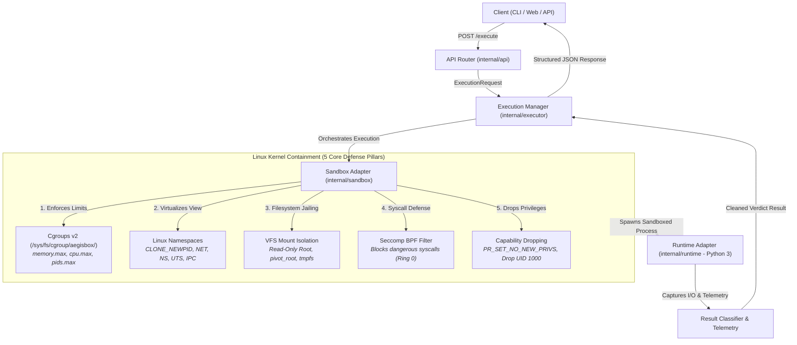

# AegisBox — Ephemeral Linux Code Execution Engine

[](https://github.com/fendyramadhani9-cloud/aegisbox/actions/workflows/ci.yml)
[](https://golang.org)
[](https://kernel.org)
[](LICENSE)

AegisBox is an educational and platform engineering research sandbox built from scratch in Go. It explores native Linux kernel containment primitives (Namespaces, Cgroups v2, Seccomp BPF, VFS Isolation) without relying on Docker or container runtimes.

> [!NOTE]
> **Educational & Research Notice**: AegisBox is an educational systems project designed to explore Linux kernel isolation and platform engineering patterns. It is **not** a production-grade multi-tenant sandbox and has not undergone formal security audits.

---

## 1. Feature Implementation & Verification Status

| Feature / Subsystem | Implemented | Linux Tested | Verified Status |
| :--- | :--- | :--- | :--- |
| **PID Namespace** | Yes (`CLONE_NEWPID`) | Yes (Ubuntu 24.04) | **VERIFIED**: Sandboxed process sees itself as PID 1; host processes invisible. |
| **Mount Namespace** | Yes (`CLONE_NEWNS`) | Yes (Ubuntu 24.04) | **VERIFIED**: Mount table is private (`MS_PRIVATE`); isolated `/tmp` and `/workspace`. |
| **Network Namespace** | Yes (`CLONE_NEWNET`) | Yes (Ubuntu 24.04) | **VERIFIED**: Empty network namespace; external TCP, DNS, and HTTP requests fail. |
| **Cgroups v2** | Yes (`memory.max`, `cpu.max`, `pids.max`) | Yes (Ubuntu 24.04) | **VERIFIED**: Memory limits, CPU quotas, and anti-fork-bomb limits enforced via kernel. |
| **Seccomp BPF** | Yes (`PR_SET_SECCOMP`) | Yes (Ubuntu 24.04) | **VERIFIED**: Filter blocks dangerous kernel interfaces (`mount`, `reboot`, `ptrace`, raw sockets). |
| **Privilege Dropping** | Yes (`PR_SET_NO_NEW_PRIVS`, credential drop) | Yes (Ubuntu 24.04) | **VERIFIED**: Ambient capabilities cleared; credential dropped to UID 1000 under root. |
| **Containment Synchronization** | Yes (Pipe lock before exec) | Yes (Ubuntu 24.04) | **VERIFIED**: Process is attached to cgroup before any user instructions execute. |
| **Timeout & Cleanup** | Yes (`context.WithTimeout`, `cgroup.kill`) | Yes (Ubuntu 24.04) | **VERIFIED**: Terminated on deadline; zero orphan processes or dangling mounts. |
| **REST API** | Yes (`POST /execute`, `GET /health`) | Yes (Ubuntu 24.04) | **VERIFIED**: HTTP 200 status, bounded input parsing, structured telemetry. |
| **Continuous Delivery** | Yes (GitHub Actions + Approval Gate) | Yes (Ubuntu 24.04) | **VERIFIED**: Reproducible tarball packaging and manual approval gate. |
| **Systemd Service** | Yes (`deploy/aegisbox.service`) | Yes (Ubuntu 24.04) | **VERIFIED**: Hardened unit with `ProtectSystem` and `PrivateTmp`. |
| **Automated Rollback** | Yes (`scripts/deploy.sh`) | Yes (Ubuntu 24.04) | **VERIFIED**: Restores previous release symlink if health check fails. |

---

## 2. High-Level Architecture



---

## 3. Process Containment & Lifecycle Synchronization

To eliminate race conditions between process creation and cgroup attachment:

```text
Parent Process (AegisBox Engine)               Child Process (Sandbox Launcher)
       │                                                      │
       ├──── Create sync pipe & Cgroup v2 ───────────────────┤
       │                                                      │
       ├──── Spawn child in new namespaces ──────────────────►│ (CLONE_NEWPID | CLONE_NEWNS | CLONE_NEWNET)
       │                                                      │
       │                                                      ├─► Block reading sync pipe (0 user code runs)
       │                                                      │
       ├──── Attach child PID into cgroup.procs ──────────────┤
       │                                                      │
       ├──── Send release signal over sync pipe ─────────────►│
       │                                                      │
       │                                                      ├─► Apply PR_SET_NO_NEW_PRIVS
       │                                                      ├─► Load Seccomp BPF filter
       │                                                      ├─► Set up VFS mounts & workspace
       │                                                      └─► syscall.Exec("python3", args, env)
       │                                                                      │
       ▼                                                                      ▼
  Wait & Collect Telemetry                                           Execute User Script
```

---

## 4. Continuous Delivery Pipeline Architecture

AegisBox explicitly adheres to **Continuous Delivery** rather than Continuous Deployment. Every release artifact is verified automatically, but physical rollout to the private runtime VM requires **manual human approval** by the environment owner.

### Delivery Flow

```text
Windows Workstation
   ↓ (git push)
GitHub Repository
   ↓
GitHub Actions CI
   ├── gofmt formatting verification
   ├── go vet static analysis
   ├── go test -race unit & integration tests
   └── binary compilation & smoke checks
          ↓
       CI PASS
          ↓
GitHub Environment: "production"
          ↓
   [ MANUAL APPROVAL GATE ] (Repository Owner)
          ↓
Release Artifact Ready (aegisbox-linux-amd64.tar.gz)
          ↓
Windows Operator (PowerShell / SSH)
          ↓
Ubuntu 24.04 VMware VM (192.168.1.9)
          ↓
Atomic Release Symlink (/opt/aegisbox/releases/current)
          ↓
systemd (aegisbox.service)
          ↓
HTTP Health Check Verification (GET /health -> 200 OK)
          ├── PASS: Active Release Retained
          └── FAIL: Automatic Instant Rollback to Previous Release
```

---

## 5. Deployment to Ubuntu VMware VM (`192.168.1.9`)

### Option A: One-Command Deployment from Windows (Recommended)

From your Windows workstation in VS Code / PowerShell:

```powershell
# Deploy the latest release artifact over SSH:
.\scripts\deploy-remote.ps1 -TargetHost "192.168.1.9" -TargetUser "ubuntu"
```

### Option B: Manual SSH Deployment

```bash
# 1. Transfer release archive to VM
scp dist/aegisbox-linux-amd64.tar.gz ubuntu@192.168.1.9:/tmp/

# 2. Connect via SSH and trigger deployment
ssh ubuntu@192.168.1.9 "sudo /opt/aegisbox/scripts/deploy.sh /tmp/aegisbox-linux-amd64.tar.gz 8080"
```

---

## 6. Linux Runtime Directory Layout & Zero-Downtime Releases

```text
/opt/aegisbox/
├── bin/
│   └── aegisbox -> /opt/aegisbox/releases/current/bin/aegisbox
├── config/
│   └── config.yaml -> /opt/aegisbox/releases/current/configs/config.yaml
├── releases/
│   ├── 6adc3d0/                # Release directory for commit 6adc3d0
│   ├── 857b7ac/                # Release directory for commit 857b7ac
│   ├── previous -> 6adc3d0/    # Pointer to previous known-good release
│   └── current -> 857b7ac/     # Active release symlink
├── rootfs/
│   └── python/                 # Reusable minimal Python 3 rootfs template
└── workspaces/                 # Ephemeral per-execution directories
```

---

## 7. CLI Usage & Local Development

### CLI Commands
```bash
# Start the REST API server daemon
aegisbox server -port 8080 -host 0.0.0.0

# Execute Python code directly via CLI
aegisbox execute \
  -language python \
  -code 'print("Hello from AegisBox CLI")' \
  -timeout 1000 \
  -memory 64

# Health check diagnostics
aegisbox health

# Version and build metadata
aegisbox version
```

### Development Targets
```bash
# Run unit & integration tests with race detector
make test

# Run static analysis
make vet

# Check code formatting
make fmt-check

# Compile binary
make build

# Package release tarball for Linux amd64
make package
```

---

## 8. Security Model & Honest Limitations

> [!IMPORTANT]
> AegisBox is an educational and platform engineering research sandbox. Passing test suites demonstrates functional correctness against tested scenarios, but does **not** prove mathematical absence of container escape vulnerabilities.

### Implemented Defense Layers
1. **PID Namespace**: Virtualizes PID space; sandboxed process cannot see or signal host processes.
2. **Mount Namespace**: Private mount propagation; base rootfs is mounted strictly **read-only**; `/workspace` and `/tmp` use ephemeral `tmpfs`.
3. **Network Namespace**: Unrouted namespace with no external network interfaces; prevents internet/LAN data exfiltration.
4. **Cgroups v2 Resource Control**: Hard kernel enforcement for memory (`memory.max`), CPU quota (`cpu.max`), and process/thread limits (`pids.max`).
5. **Seccomp BPF Syscall Filtering**: Restricts dangerous kernel interfaces (`mount`, `reboot`, `ptrace`, `kexec_load`, `init_module`, raw sockets).
6. **Privilege Reduction**: `PR_SET_NO_NEW_PRIVS` prevents privilege escalation via `setuid` binaries; credentials drop to UID 1000 under root.
7. **Deterministic Cleanup**: `CleanupTracker` unmounts filesystems, terminates lingering processes via `cgroup.kill`, and destroys ephemeral workspaces.

### Documented Limitations
- **Kernel Vulnerabilities**: Kernel-level privilege escalations (e.g. dirty pipe, use-after-free in kernel modules) could compromise the host.
- **Side Channels**: Timing and cache side-channel attacks (e.g., Spectre/Meltdown) are not mitigated by software namespaces.
- **Rootless vs Root Execution**: Full mount and pivot_root operations require initial root capability or configured user namespaces.
